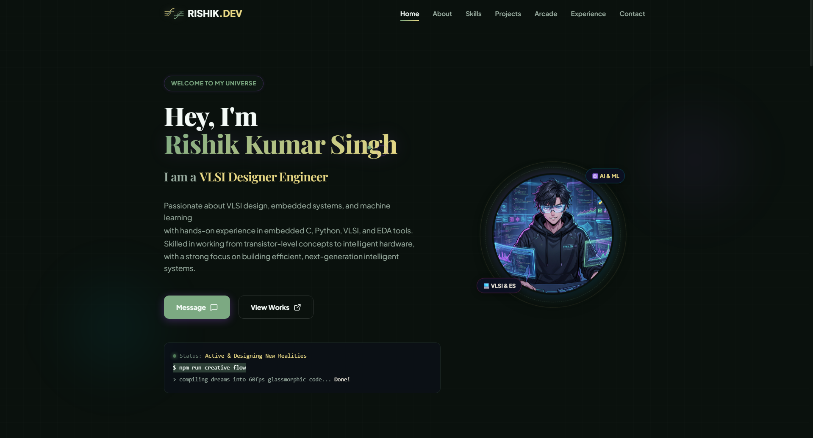

# 🌿 Premium Nature Botanical Developer Portfolio

A high-performance, visually stunning developer portfolio website inspired by high-end interactive editorials. Built with a deep organic forest shadow theme, custom glassmorphism panels, drifting botanical dew particles, and fluid momentum-based scrolling physics.

---

## ✨ Features

- 🌿 **Organic Botanical Aesthetic**: A premium nature theme featuring deep pine shadow, sage leaf borders, and warm sunflower sunbeam highlights.
- 🌊 **Inertial Momentum Scrolling**: Global buttery-smooth physics-based scrolling powered by the industry-standard **Lenis** engine.
- ⚡ **Line-by-Line Staggered Reveals**: IntersectionObserver-based text transitions that slide and fade in staggered sequences as they enter the viewport.
- 🎮 **Interactive Canvas Arcade**: A fully responsive retro **Snake Game** built from scratch utilizing the HTML5 Canvas API in React, featuring touchscreen D-pad controls for mobile and localStorage high score tracking.
- 🛰️ **Reactive Cursor Spotlight**: A spotlight effect that tracks mouse coordinates on project cards.
- 📬 **Transmitting Contact Widget**: A beautiful glass-shaded contact form integrated with **Web3Forms** and local environment variables for secure transmission.
- 🖼️ **Custom AI-Generated Illustrations**: Stunning computer vision showcase assets integrated as project headers.

---

## 🛠️ Technology Stack

- **Core**: React 19 + TypeScript
- **Bundler & Dev Server**: Vite 8
- **Styling Engine**: Tailwind CSS v4 + Vanilla CSS Variables
- **Animations**: Framer Motion
- **Momentum Physics**: Lenis Scrolling Engine
- **Forms**: Web3Forms API Integration

---

## 🚀 How to Run Locally

### 1. Clone the repository and navigate into the folder:
```bash
cd "C:\Users\Rishik Kumar Singh\OneDrive\Desktop\pro2"
```

### 2. Install dependencies:
```bash
npm install
```

### 3. Spin up the Vite development server:
```bash
npm run dev
```

### 4. Build for production:
```bash
npm run build
```

---

## 🔒 Security Configuration
Private configuration keys and tokens are securely isolated in a local-only `.env` file, which is actively ignored by the local `.gitignore` rule to prevent credentials from ever leaking to public repository feeds.

---

## 📸 Preview

First Face of website

<!-- Simple -->

